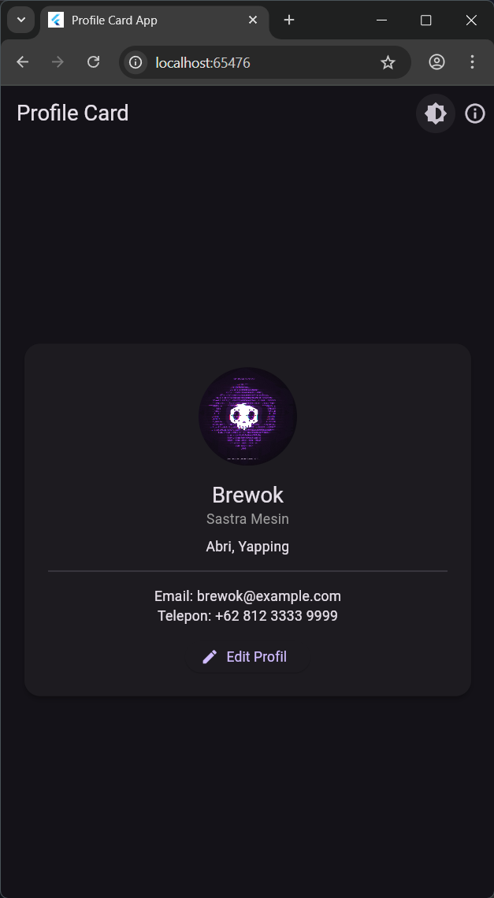

# 🪪 Profile Card App

Aplikasi Flutter sederhana untuk menampilkan **kartu profil interaktif**, dilengkapi dengan fitur edit data, halaman tentang aplikasi, dan pengaturan tema terang/gelap.

---

## ✨ Fitur Utama

✅ **Kartu Profil Interaktif**  
Menampilkan nama, jabatan, deskripsi, email, dan nomor telepon dengan tampilan modern.

✅ **Edit Profil**  
Menggunakan `StatefulWidget` dan `TextEditingController` untuk memperbarui data secara langsung.

✅ **Tema Terang & Gelap**  
Mendukung perubahan tema secara manual (icon 🌙 di AppBar) atau otomatis mengikuti sistem.

✅ **Halaman Tentang Aplikasi**  
Navigasi ke halaman *Tentang* yang berisi informasi singkat mengenai aplikasi dan pembuatnya.

✅ **Gambar Lokal dengan Fallback**  
Menampilkan gambar dari folder `assets/`, dan otomatis menampilkan ikon default jika gambar tidak ditemukan.

---

## 🧠 Konsep Flutter yang Digunakan

| Konsep | Penjelasan |
|--------|-------------|
| `MaterialApp` | Mengatur routing, tema, dan tampilan utama aplikasi |
| `StatefulWidget` | Mengubah data profil secara real-time |
| `ThemeMode` | Mendukung tema terang, gelap, dan sistem |
| `Navigator.pushNamed()` | Navigasi antar halaman |
| `Image.asset()` + `errorBuilder` | Menampilkan gambar lokal dengan fallback |
| `Card`, `Column`, `TextField`, `ElevatedButton` | Elemen UI modern dan responsif |

---

## 🗂️ Struktur Folder

```
profile_card_app/
├── assets/
│   └── profile_pic.jpg
├── lib/
│   ├── main.dart
│   ├── theme/
│   │   └── app_theme.dart
│   └── screens/
│       ├── profile_page.dart
│       └── about_page.dart
├── pubspec.yaml
└── README.md
```

---

## 📱 Deskripsi Halaman

### 🔹 `ProfilePage`
- Menampilkan informasi profil pengguna.  
- Dapat mengedit nama, email, dan telepon.  
- Tombol tema untuk beralih mode terang/gelap.  
- Tombol info menuju halaman tentang.

### 🔹 `AboutPage`
- Menampilkan deskripsi singkat aplikasi.  
- Informasi pembuat dan versi aplikasi.  
- Tombol kembali ke halaman profil.

---

## 🖼️ Screenshot Tampilan


---

## 👨‍💻 Dibuat oleh

**Haidir Mirza Ahmad Zacky**

**Informatics Engineer**
